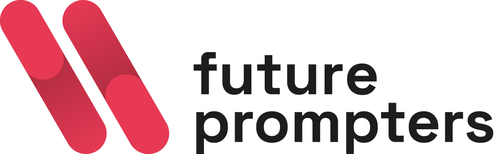

Download MagicAnimate checkpoints by:
```bash
git lfs clone https://huggingface.co/zcxu-eric/MagicAnimate
```

<!-- Improved compatibility of back to top link: See: https://github.com/othneildrew/Best-README-Template/pull/73 -->
<a name="readme-top"></a>
<!--
*** Thanks for checking out the Best-README-Template. If you have a suggestion
*** that would make this better, please fork the repo and create a pull request
*** or simply open an issue with the tag "enhancement".
*** Don't forget to give the project a star!
*** Thanks again! Now go create something AMAZING! :D
-->


<!-- PROJECT SHIELDS -->
<!--
*** I'm using markdown "reference style" links for readability.
*** Reference links are enclosed in brackets [ ] instead of parentheses ( ).
*** See the bottom of this document for the declaration of the reference variables
*** for contributors-url, forks-url, etc. This is an optional, concise syntax you may use.
*** https://www.markdownguide.org/basic-syntax/#reference-style-links
-->
<!-- [![Contributors][contributors-shield]][contributors-url]
[![Forks][forks-shield]][forks-url]
[![Stargazers][stars-shield]][stars-url]
[![Issues][issues-shield]][issues-url]
[![MIT License][license-shield]][license-url]
[![LinkedIn][linkedin-shield]][linkedin-url] -->


<!-- PROJECT LOGO -->
<br />
<div align="center">
  <a href="https://github.com/futureprompters/pose-translation">
    
  </a>
<br/>
<br/>
<h1 align="center">PoseTranslation Demo</h1>

  <p align="center">
    PoseTranslation is a project that enables the transfer of motion from a video onto a selected photograph. Unlike similar solutions, it allows for the direct transfer of motion from the body rather than from previously extracted poses. 
    <br />
    <a href="https://huggingface.co/spaces/FuturePrompters/PoseTranslation"><strong>Play with the Demo at 🤗 HF Spaces »</strong></a>
    <br />
    <br />
    <a href="https://github.com/futureprompters/pose-translation">PoseTranslation Repo</a>
  </p>
</div>

## About The Project

Our project enriches **MagicAnimate** with a feature that allows for pose transfer **directly from the silhouette**, eliminating the need for users to manually extract poses. This approach enables easy usage of the software for entertainment purposes. PoseTranslation is available on 🤗 Hugging Face Spaces.

The goal behind the creation of **PoseTranslation** was to bring an interesting solution closer to a wider range of users with less technical skills. We believe that by doing so, we contribute to the democratization of AI.


### Key Features of Our Project:

- **Accessibility**: By hosting PoseTranslation on Hugging Face Spaces, we provide easy access to this advanced technology, fostering broader experimentation and understanding within the AI community.
- **Entertainment Tool**: The tool allows creators to replicate motion sequences without the need to physically perform them. From now on, anyone can move like their favorite celebrity.

Give it a shot and play with the PoseTranslation on [🤗 HF Spaces](https://huggingface.co/)


## Technical Details

This section outlines the key technical aspects of our PoseTranslation deployment, including the generation of model weights, model foundations, and the hardware requirements for using the current weight configurations.

### Model Foundations
PoseTranslation is built upon Stable Diffusion v1.5, SD-VAE-MSE by StabilityAI, and ControlNet, AppearanceEncoder, TemporalAttention architectures by MagicAnimate. Additionally, it utilizes detectron2 as used in vid2densepose by Flode-Labs.

## Local Deployment

Our deployment of PoseTranslation has been dockerized to streamline the setup process and ensure consistency across different environments. Below are the details on how to deploy PoseTranslation locally, the processes it initiates, and how to interact with the Gradio-based UI.

### Prerequisites

Before proceeding with the local deployment of PoseTranslation, it's essential to ensure that your system meets the following prerequisites:

- **Docker**: Docker must be installed and running on your machine. Docker is used to containerize the PoseTranslation environment, ensuring that it can be deployed consistently across any platform. If you haven't installed Docker yet, visit the [official Docker website](https://www.docker.com/get-started) for installation instructions tailored to your operating system.

Having Docker installed is crucial for the deployment process, as it encapsulates the PoseTranslation application and its dependencies within a container, simplifying the setup and execution steps. This approach also isolates the PoseTranslation environment from your system, minimizing potential conflicts with existing software or dependencies.

### Dockerized Deployment
To deploy PoseTranslation locally, utilize the following Docker commands. These steps will prepare your environment for running PoseTranslation:
- Build the image
  ```bash
  docker build -t posetranslation .
  ```
- Run the image with exposure of Gradio's port
  ```bash
  docker run posetranslation -p 7860:7860
  ```
- Access the Gradio based UI via Web Browser - http://0.0.0.0:7860/


### Accessing the Gradio-based UI
Once the Docker container is up and running, and the processes outlined above are initiated, you can access PoseTranslation's interactive UI through the Gradio web interface. This interface allows users to interact with PoseTranslation in real-time, engaging in visual and textual dialogues. The Gradio-based UI is designed to be intuitive, making it easy for users to explore PoseTranslation's capabilities by uploading images and posing questions or commands related to the visual content.

Usually, the Gradio UI should be accessible via http://0.0.0.0:7860/

By following these guidelines, you can effectively deploy PoseTranslation within a local environment, leveraging its advanced multimodal conversational features through a user-friendly interface.

## Contributing

Contributions are what make the open source community such an amazing place to learn, inspire, and create. Any contributions you make are **greatly appreciated**.

If you have a suggestion that would make this better, please fork the repo and create a pull request. You can also simply open an issue with the tag "enhancement".
Don't forget to give the project a star! Thanks again!

1. Fork the Project
2. Create your Feature Branch (`git checkout -b feature/AmazingFeature`)
3. Commit your Changes (`git commit -m 'Add some AmazingFeature'`)
4. Push to the Branch (`git push origin feature/AmazingFeature`)
5. Open a Pull Request

## License

Our project and its deployment on Hugging Face Spaces, including the modifications and use of the code, are based on Show Lab and Bytedance MagicAnimate, Flode Labs vid2densepose and Detectron2 from Facebook AI software and its associated licensing terms. It is crucial for users and contributors to our project to recognize and respect the copyright and licensing terms as established by all of the above software providers.

This project is intended for research and educational purposes, aiming to demonstrate the capabilities of solutions like PoseTranslation.

For further details about the license and your obligations as a user or contributor, please refer to the [MagicAnimate](https://github.com/magic-research/magic-animate?tab=BSD-3-Clause-1-ov-file), [vid2densepose](https://github.com/Flode-Labs/vid2densepose?tab=MIT-1-ov-file), [Detectron2](https://github.com/facebookresearch/detectron2?tab=Apache-2.0-1-ov-file) It is the responsibility of each individual to ensure their use of the PoseTranslation software complies with the specified terms.

## Acknowledgments

* [MagicAnimate](https://showlab.github.io/magicanimate/) - huge part of this project was based on MagicAnimate
* [vid2densepose](https://github.com/Flode-Labs/vid2densepose) - The creation of this demo was made possible through the use ofvid2densepos
* [Detectron2](https://github.com/facebookresearch/detectron2) - backbone of vid2densepose
* [TikTokDancing][https://datasetninja.com/full-body-tiktok-dancing-dataset] - The demo utilized TikTok DancingDataset

## About The Future Prompters
TODO